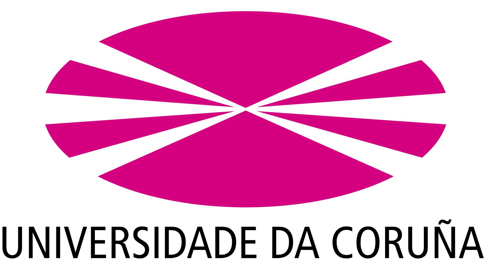
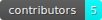
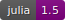
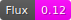
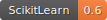
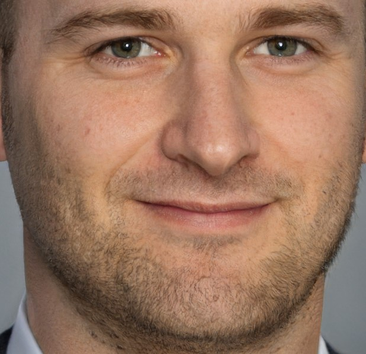
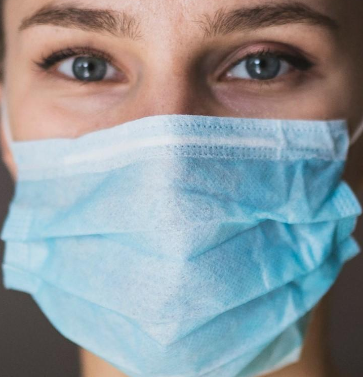
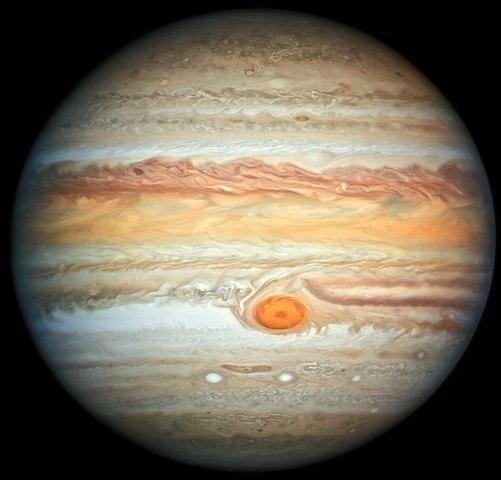
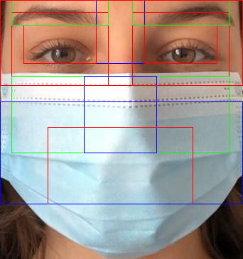

# **Sistema de detección de mascarillas en rostros**
<br>
<p align="center">
  
<br><br>







## Autores
* Pedro Guijas Bravo
* Eliseo Bao Souto
* Daniel Boubeta Portela
* Eduardo Pérez Fraguela
* Héctor Padín Torrente

## Dependencias
```julia
julia> import Pkg; Pkg.update();
julia> Pkg.add("DelimitedFiles");
julia> Pkg.add("Flux");
julia> Pkg.add("PyPlot");
julia> Pkg.add("ScikitLearn"));
```

## **Introducción**

Debido a las circunstancias en las que nos encontramos, reconocer caras con mascarillas se ha vuelto una necesidad que los sistemas de reconocimiento facial pre-pandémicos no son capaces de llevar a cabo. En este trabajo se propone un sistema simple que intenta imitar el proceso interno de reconocimiento facial para reconocer si un individuo lleva mascarilla o no, mediante las dos etapas básicas que conforman un sistema automático: extracción de características de una cara y clasificación de esta en una de las tres clases dadas (no es un rostro, es un rostro, rostro con mascarilla).

Para resolver el problema, utilizaremos una Redes de Neuronas Artificiales (RR.NN.AA.) *densas* y Redes de Neuronas Convolucionales (C.N.N.), Máquinas de Soporte Vectorial (SVM) o en inglés *Support Vector Machine*, k-vecinos próximos (KNN), en inglés *k-Nearest Neighbors*. En las RR.NN.AA., probaremos con distintas arquitecturas, de forma que nos quedemos con la configuración que mejores resultados obtenga y mejor se adapte al problema.

## **Dataset**
La Base de Datos (BD) del problema ([ver aquí](https://mega.nz/fm/wdYAALxL)) ha sido realizada por nosostros mismos. Para crear la base de datos, elegimos minuciosamente las imágenes siguiendo las pautas previamente establecidas en las restricciones, sacando las fotos de nuestros conocidos o familiares y de internet en páginas como [*This person does not exist*](https://thispersondoesnotexist.com). Cuenta con 140 imágenes de caras sin mascarillas, 140 imágenes de no-caras y 140 imágenes de caras con mascarillas.

| Cara | Cara con mascarilla | No cara |
:-:|:-:|:-:
  |   | 


Para generar el archivo faces.data (ya existe en el repositorio), ya sea porque se quiere cambiar la extracción o por el motivo que sea, será necesario descargar el dataset con imágenes. También será necesario descargarlo si queremos ejecutar el modelo de CNN, que se encuentra en <code>DL.jl</code>, ya que a estos modelos se les pasan las imágenes en 'crudo'. Actualmente se aplica la extracción de características que aparece en la siguiente imagen, aun que se pueden aplicar hasta 8 extracciones diferentes.

<p align="center">
  
<br><br>

### Generación del dataset
Tenemos un archivo llamado *dataset.zip*, que contiene todas las imágenes que utilizamos en el desarrollo de la práctica. Por lo tanto, para cambiar la extracción llegaría con descomprimir este archivo en la ruta en la que se encuentra.
```bash
cd datasets
unzip datasets.zip
```
## **Resultados**
Se muestran a continuación las bondades finales para los distintos modelos con sus parámetros óptimos (en las *CNN* el resultado de la precisión es tan solo en un entrenamiento).
<div align="center">

| | RNA | CNN | SVM | Árbol de Decisión | KNN |
|:-:|:-:|:-:|:-:|:-:|:-:|
| Precision | 91.12% | 100% | 95.63% | 82.78% | 90.36% |
| F1-Score | 90.95% | N.A.% | 95.54% | 82.60% | 90.47% |

</div>

En los siguientes cuadros mostramos las matrices de confusión finales para nuestros modelos, ejecutando también cada uno de ellos con los parámetros óptimos:

<div align="center">

| | Cara | Mascarilla | No Cara |
|:-:|:-:|:-:|:-:|
| Cara | 16 | 0 | 0 |
| Mascarilla | 0 | 12 | 0 |
| No Cara | 0 | 0 | 13 |

Matriz de confusion para RNA.

| | Cara | Mascarilla | No Cara |
|:-:|:-:|:-:|:-:|
| Cara | 16 | 0 | 0 |
| Mascarilla | 0 | 12 | 0 |
| No Cara | 0 | 0 | 13 |

Matriz de confusion para SVM con kernel gausiano.

| | Cara | Mascarilla | No Cara |
|:-:|:-:|:-:|:-:|
| Cara | 11 | 0 | 0 |
| Mascarilla | 0 | 15 | 0 |
| No Cara | 1 | 1 | 10 |

Matriz de confusion para KNN.

| | Cara | Mascarilla | No Cara |
|:-:|:-:|:-:|:-:|
| Cara | 19 | 0 | 0 |
| Mascarilla | 1 | 11 | 2 |
| No Cara | 1 | 1 | 5 |

Matriz de confusion para Árboles de Decisión.
</div>
